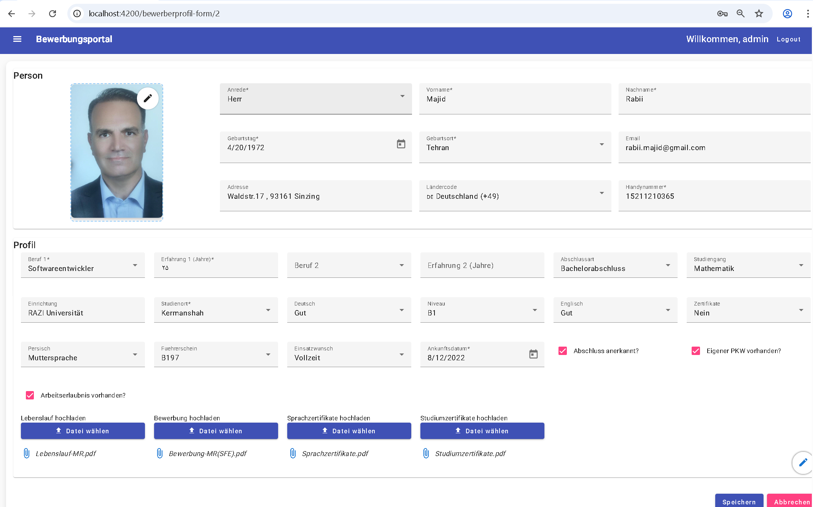

# Bewerberportal (Fullstack-Projekt)

## 🌍 Beschreibung (Deutsch)

Dies ist ein vollständiges Fullstack-Projekt für ein Bewerberportal, das ich als Lernprojekt entwickelt habe. Es besteht aus einem Angular-Frontend und einem ASP.NET Core-Backend mit PostgreSQL-Datenbank.

Ich habe im März 2025 begonnen, mich intensiv mit modernen Frontend-Technologien wie Angular, TypeScript und Angular Material zu beschäftigen. Da ich bereits fundierte Kenntnisse im Backend-Bereich (z. B. Web API mit ASP.NET Core) hatte, konnte ich meinen Fokus auf die Entwicklung kompletter Fullstack-Anwendungen legen.

Zusätzlich zu meinen bestehenden Kenntnissen in C#, Entity Framework Core und relationalen Datenbanken (PostgreSQL), habe ich mich mit folgenden Technologien vertraut gemacht:

- 🧩 Angular (Standalone Components)
- 🎨 Angular Material (UI-Komponenten)
- 🔐 Benutzerregistrierung, Passwort-Hashing mit bcrypt, JWT-Authentifizierung
- 📡 Kommunikation über RESTful APIs
- 🧠 AuthGuard & Routing-Struktur in Angular
- 🗄️ Entity Framework Core + PostgreSQL

### 🔧 Projektstruktur

- `frontend/`: Angular 19 Anwendung mit Authentifizierung, Profilverwaltung, Lazy Loading, Guards und Dialog-Komponenten.
- `backend/`: ASP.NET Core Web API mit Benutzerverwaltung, Passwort-Verschlüsselung, Token-Verwaltung, Entity Models und DbContext.

---

## 🇬🇧 Description (English)

This is a fullstack project for an applicant portal, developed as part of my personal learning journey. It consists of an Angular frontend and a .NET backend with a PostgreSQL database.

In March 2025, after becoming unemployed, I decided to focus on modern frontend technologies like Angular, TypeScript, and Angular Material. As I already had experience in backend development with ASP.NET Core and Web APIs, I expanded my skills to build fullstack applications.

In addition to my backend expertise (C#, EF Core, PostgreSQL), I gained hands-on experience with:

- 🧩 Angular (standalone components)
- 🎨 Angular Material UI
- 🔐 User registration, password hashing with bcrypt, JWT authentication
- 📡 REST API communication
- 🧠 AuthGuard & routing
- 🗄️ EF Core + PostgreSQL

---

## 🖼️ Screenshots

### 🔐 Login Page


### 🧑‍💼 Profilverwaltung


### 🧭 StadtListe nach dem Login


---

## ▶️ Anwendung starten

### Backend starten (ASP.NET Core)
```bash
cd backend
dotnet run

### Frontend starten (Angular)
cd frontend
npm install
ng serve

💼 Autor
Majid Rabii
📫 rabii.majid@gmail.com
🌐 [LinkedIn](https://www.linkedin.com/in/majid-rabii-3633a336/)
